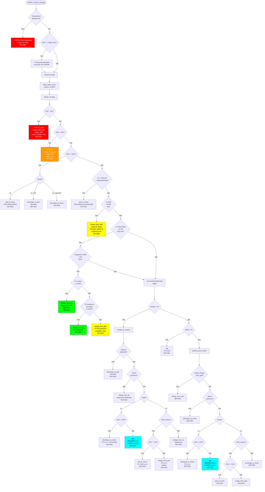

# Drzewo Decyzyjne Algorytmu Baterii

Data: 2025-11-18
Wersja: 3.2 (po fix L1 charging)

## Diagram Mermaid - Pełne Drzewo Decyzyjne



## Kluczowe Priorytety (od najwyższego):

1. **🚨 BEZPIECZEŃSTWO** (temperatura, SOC krytyczne)
2. **⚡ L2 ŁADOWANIE** (tanie 0.72 zł - niezależnie od PV)
3. **🌞 PV MAGAZYNOWANIE** (darmowe - priorytet!)
4. **💰 ARBITRAŻ** (sprzedaż gdy opłacalna)
5. **🏠 AUTOCONSUMPTION** (reszta przypadków)

## Źródła Energii - Priorytet Kosztowy:

```
PV (darmowe) > L2 sieć (0.72 zł) > Bateria > L1 sieć (1.11 zł)
```

## Kluczowe Progi:

- **SOC < 5%**: KRYTYCZNE - ładuj 24/7 do 35%
- **SOC < 20%**: PILNE - ładuj w L2 do 20%
- **SOC ≤ 20% w L1**: CZEKAJ na L2 (NIE ładuj!)
- **SOC > 20% w L1**: Rozładowuj (oszczędzaj L1)
- **SOC ≥ 80%**: Pełna - różne strategie zależnie od taryfy
- **Target SOC**: Cel ładowania (zwykle 70-80%)

## Okna Czasowe:

- **L2 NOC**: 22:00-06:00 (ładuj do Target)
- **L2 POŁUDNIE**: 13:00-15:00 (inteligentne: PV > sieć)
- **L1**: 06:00-13:00, 15:00-22:00 (NIE ładuj, rozładowuj!)

## Tryby Pracy:

1. **charge_from_grid** → TOU mode + grid charging ON
2. **charge_from_pv** → maximise_self_consumption
3. **discharge_to_home** → maximise_self_consumption
4. **discharge_to_grid** → maximise_self_consumption + settings
5. **grid_to_home** → TOU mode + discharge 0W
6. **idle** → maximise_self_consumption + charge OFF
